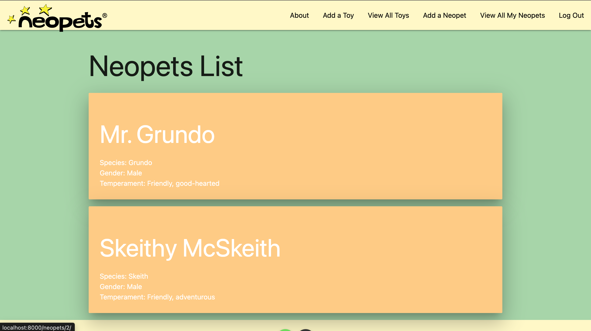

# Neopets!

## **Welcome to my Neopets Mock-up** ##

For this app, I dove into django and brought out just a bit of my childhood memories playing neopets many years ago. In the original Neopets, you collect your neopets and play games with them, go on adventures, feed them and play with them like any other real pet, all from the browser of your computer. I replicated just a small fraction of that here with the ability to add neopets to your collection, give them toys to play with, and adding meals to feed them from a calander to know when they ate last. 

## Table of Contents
* [Technologies Used](#technologiesused)
* [Features](#features)
* [Screenshots](#screenshots)
* [Deployed App](#deployment)
* [Next Steps](#nextsteps)

## Technologies Used
* Python
* Django
* PostgreSQL
* HTML
* CSS
* Materialize CSS
* Heroku

## Features
* Users can login to be authorized to have their own database collection of neopets, toys, and feedings for their neopets
* Users have full CRUD over instances of their Neopet and Toy models, as well as the ability to add feeding date and times to neopet instances

## Screenshots

## Deployed App
* [Deployed link](https://neopets-ga-proj4.herokuapp.com/)

## Next Steps
* Would like to implement 3rd party API for data collection of neopets, so that when species is searched by the user, the associated image can be displayed on neopets card
* Once above is done, having a search field or database display of all neopets visually for users to pick their neopet would be the next step
